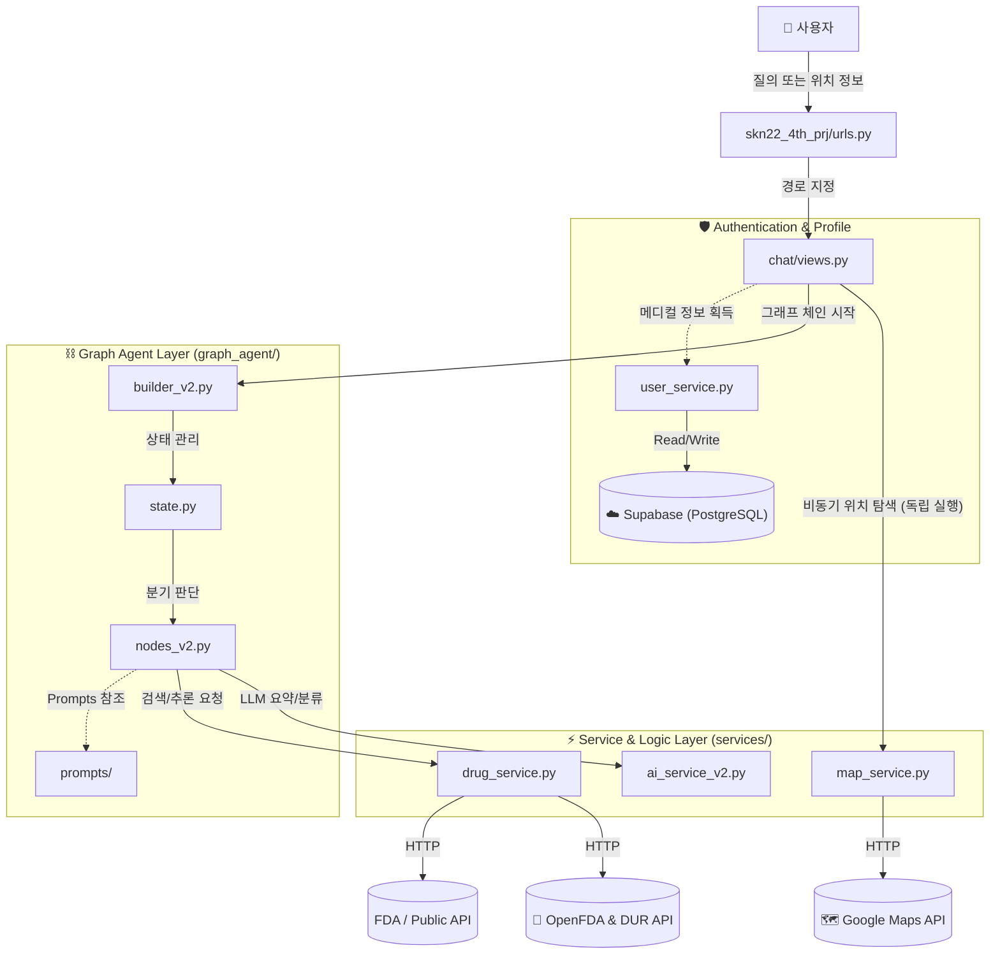
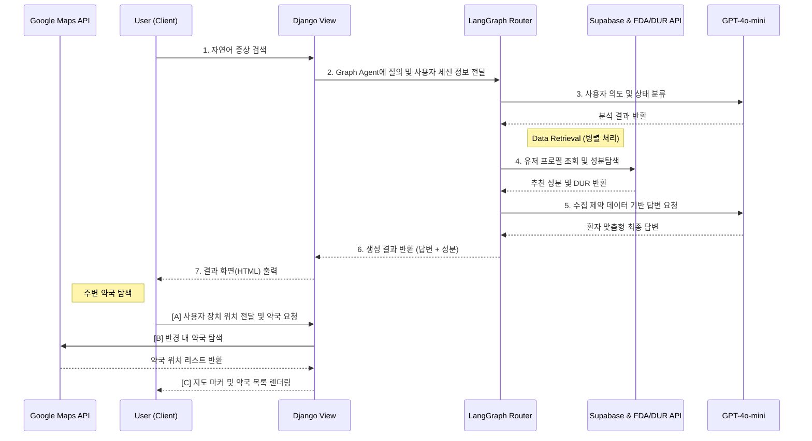

<div align="center">

# 🚑 AI 증상 기반 약품 추천 서비스 (SKN22-4th-1Team)

[](https://python.org)
[](https://www.djangoproject.com)
[](https://openai.com)
[](https://langchain.com)
[](https://supabase.com)

<br/>

**사용자의 증상을 이해하고 DUR(안전주의) 정보와 맞춤형 약품 및 주변 약국을 안내하는 스마트 의료/약국 AI 비서**

</div>

---

> [!CAUTION]
> **⚠️ 의료 면책 조항 (Medical Disclaimer)**
> 
> 본 시스템은 **OpenFDA, 공공데이터포털(KCD-9/DUR)** 데이터를 기반으로 정보를 제공하며, **의학적 진단이나 처방을 대신할 수 없습니다.**
> 
> - 🔴 제공된 정보는 실시간 API 검색 결과이나, AI 가공 과정에서 부정확한 내용이 연출될 수 있습니다.
> - 🔴 **모든 건강 관련 결정은 반드시 의사 또는 약사와 상담 후 진행하세요.**
> - 🔴 기저질환, 임신 여부, 알레르기에 따른 부작용은 개인에 따라 상이하므로 참고용으로만 활용 바랍니다.
> - 🔴 본 시스템 사용으로 인한 어떠한 피해에 대해서도 책임지지 않습니다.

---

## 📋 목차

- [기술 스택](#-기술-스택)
- [프로젝트 구조](#-프로젝트-구조)
- [시스템 아키텍처](#-시스템-아키텍처)
- [단계별 상세 설명](#단계별-상세-설명)
- [작동 데모](#-작동-데모)
- [트러블슈팅 및 극복 사례](#-트러블슈팅-및-극복-사례)
- [향후 로드맵](#-향후-로드맵)
- [실행 방법](#-실행-방법)
- [질문 예시](#-질문-예시)
- [주요 설정](#-주요-설정)
- [팀원 소개](#-팀원-소개)

---

## 🛠 기술 스택

| 분류 | 기술 | 설명 |
|:---:|:---:|:---|
| 🖥️ **Backend & UI** | Django | MVT 아키텍처 기반 웹페이지 인터페이스 및 서비스 통합 |
| 🤖 **Orchestrator** | LangGraph | State Graph를 활용한 에이전트 단계 제어 (분류/검색/생성) |
| ✍️ **Agent Core** | GPT-4o-mini | 의도 분류 로직(Classifier) 및 질의응답 응답(Generator) |
| ☁️ **External API** | OpenFDA | 미국 FDA 약품 라벨 및 가이드라인 DB 검색 연동 |
| 🔧 **Data & Auth** | Supabase (PostgreSQL) | 유저 인증 및 프로필/DUR 관리 데이터 소스 |
| 📡 **External API** | Google Maps API | 내 주변 반경 내 약국 및 병원 확인 |

---

## 📁 프로젝트 구조

```text
/Users/eom/내 드라이브/workspaces/SKN22-4th-1Team
├── 🚀 skn22_4th_prj/               # Django 백엔드 메인 어플리케이션
│   ├── chat/                       # 웹 UI 제공 기능 및 컨트롤러 모듈 (Views)
│   ├── drug/                       # DUR 검증, FDA 경고 데이터 질의 등 의약품 앱
│   ├── graph_agent/                # LangGraph 인프라 로직
│   │   ├── builder_v2.py           # 노드 매핑 및 그래프 컴파일 (Router)
│   │   ├── nodes_v2.py             # 각 단계의 작업 정의 및 실행 (State 갱신)
│   │   └── state.py                # 에이전트 상태 인터페이스 정의
│   ├── prompts/                    # LLM 페르소나 및 응답 구성 템플릿 파일
│   ├── scripts/                    # 유틸리티 및 테스트 프로파일링 스크립트 모음
│   ├── services/                   # 주요 비즈니스 및 API 연동 로직
│   │   ├── ai_service_v2.py        # LangChain LLM 통신 클래스
│   │   ├── map_service.py          # Google Map 연동 및 약국 추천
│   │   ├── drug_service.py         # DUR 및 외부 서버 정보 가공 서비스
│   │   └── user_service.py         # 유저 메디컬 프로필(알레르기, 복약) 관리
│   ├── skn22_4th_prj/              # Django Main Settings 및 URL Routing
│   └── users/                      # 인증 및 프로필 전용 App
├── 📋 requirements.txt             # 패키지 의존성
├── 📂 data_pipeline/               # KCD-9 및 DB 백업/복원 및 파이프라인 동기화
├── .env                            # 환경 설정 (API Key 등)
└── 📊 04_test_plan_results/        # 테스트 관련 폴더
```

---

## 🔄 시스템 아키텍처

본 프로젝트는 **LangGraph (Router+State Machine 패턴)** 기반의 RAG 시스템으로, 유저 정보(메디컬 프로필)와 API 조회값을 결합해 안전 필터링 단계를 강제합니다.



### 🌊 출력 파이프라인 (Data Pipeline Flow)

사용자가 증상(예: "머리가 아프고 열이 나요")을 질의했을 때, 시스템이 정보를 수집하고 답변을 출력할 때까지의 과정입니다.



### 🧩 주요 모듈 상세 설명

- **애플리케이션 계층 (`chat/views.py`)**: 사용자 인터페이스 메인 진입점. 사용자의 입력이 들어오면 세션에서 환자 정보를 조회한 뒤 LangGraph의 런타임 진입점으로 넘깁니다.
  
- **상태 기계(Graph) 계층 (`graph_agent/`)**: LangGraph 프레임워크를 통해 상태 전이를 정의합니다.
  - `builder_v2.py`: 질문의 카테고리(단순 제품 검색, 증상 기반 제품 추천, 일반 질의)에 맞게 엣지(Edge)와 노드를 연결.
  - `nodes_v2.py`: 카테고리에 맞는 상세 검색(FDA Vector 검색, 공공데이터 Open API 검색) 노드를 정의합니다. 유저의 기저 질환 등 메디컬 프로필과 추출된 성분을 결합해, 추천 전 DUR 위반사항 여부를 거치도록 안전망을 구현했습니다.

- **보안 및 인증 (`users/` & `Supabase RLS`)**: 환자 생명과 직결될 수 있는 '기록 데이터(기저질환, 알레르기 등)'의 보안 무결성을 최우선으로 합니다.
  - 일반적인 백엔드 애플리케이션 계층 방어에 의존하지 않고, 데이터베이스 엔진(PostgreSQL)의 **RLS(Row Level Security, 행 수준 보안)** 정책을 적용했습니다.
  - 사용자의 JWT 인증 토큰(User ID)이 일치하지 않는 경우, DB 엔진 레벨에서 애초에 타인의 의료 데이터를 읽거나 쓸 수 없도록 원천 차단하는 가장 견고한 보안 격리 방식을 구축했습니다.

---

## 단계별 상세 설명

### Phase 1: Classifier (Router Node)
- **파일**: [nodes_v2.py](/skn22_4th_prj/graph_agent/nodes_v2.py)
- **역할**: 
    - 사용자의 질문 내용을 `symptom_recommendation`, `product_request`, `general_medical` 카테고리 중 하나로 분류합니다.
    - 입력 오류이거나 메디컬 주제에 어긋나는 입력(Invalid)일 경우 조기에 방어합니다.

### Phase 2: User Context Integration
- **파일**: [user_service.py](/skn22_4th_prj/services/user_service.py)
- **역할**: 
    - 인증된 유저라면 복약 중인 약물, 알레르기 항목, 나이 및 임신 여부 등의 사용자 프로필 텍스트를 현재 상태(State) 데이터에 적재합니다.

### Phase 3: Data Retrieval (API Search)
- **파일**: [drug_service.py](/skn22_4th_prj/services/drug_service.py)
- **역할**: 
    - 증상 키워드(예: 복통, 두통)는 OpenFDA API Search를 이용해 적합한 효능의 약품 성분 목록을 반환받습니다.
    - 추출된 성분 후보군을 대상으로, **유저 프로필과 대조**하여 심평원 DUR API의 병용 금기 및 연령 주의정보를 HTTP 쿼리로 가져옵니다.

### Phase 4: Generator & Action (Synthesis / Map)
- **파일**: [prompts.py](/skn22_4th_prj/prompts/answer_prompts_v2.py) & [map_service.py](/skn22_4th_prj/services/map_service.py)
- **역할**: 
    - 취합된 안전/경고 리포트(DUR)와 약품의 성분 효과를 조합해, GPT-4o-mini 모델로 **가장 안전한 의사결정 방식의 최종 한국어 마크다운 답변**을 만들어 냅니다.
    - 최종 답변이 완성되면 사용자의 현재 위치를 기반으로 구글 지도를 이용해 근교 약국을 시각화합니다.

---

## Router(Graph) Pattern의 장점
1.  **의사결정의 다변화 지원**: 단순 검색은 바로 Database에서 꺼내오고, 복잡한 증상은 추론 및 필터링 노드를 여러 번 거치는 등 카테고리별로 비용 최적화가 가능합니다.
2.  **안전 필터 체인(Chain of Safety)**: RAG 모델 환각(Hallucination)의 부작용을 막기 위해 모든 약국 추천 카테고리는 DUR API 조회라는 **필수 노드**를 거치게 설계해, 모델 임의로 금기 약품을 추천하는 현상을 100% 차단합니다.
3.  **명시적 에러 핸들링**: 특정 API 호출이 실패하더라도 다른 경로로 폴백(Fallback)할 수 있는 구조적 분기능력을 보유합니다.

---
---

## 📸 작동 데모

| 🌐 웹서비스 메인 화면 | 🗺️ 반경 내 약국 검색 |
|:---:|:---:|
|  |  |
| **자연어 증상 입력 시 추천 약품 안내** | **내 위치 기반 반경 내 약국 시각화** |

---

## 🛠 트러블슈팅 및 극복 사례

프로젝트를 진행하며 겪었던 주요 기술적 챌린지와 해결 과정입니다.

### 1. LangGraph Pipeline 환각(Hallucination) 제어
- **문제**: LLM 모델이 증상 기반 약품 추천 시 가상의 약품이나, 유저의 기저질환에 치명적인 약품을 추천하는 현상 발생.
- **해결**: Router 노드에서 `symptom_recommendation`을 감지할 경우, "DUR/OpenFDA 조회 노드"를 **강제 (Mandatory) 통과**하도록 State Machine 엣지를 설계했습니다. 수집된 제약 API 반환값(Context) 외의 약물은 프롬프트 단에서 철저히 차단하는 `Chain of Safety` 아키텍처를 구현해 신뢰도를 높였습니다.

### 2. 답변 생성 지연 문제
- **문제**: 추천 성분이 여러 개일 때 심평원 병용 금기 API를 다중 호출하며 전체 응답 파이프라인 지연이 발생.
- **해결**: `drug_service.py` 내 API 호출 구조를 **병렬 비동기 호출(Async gather)** 기반으로 전면 리팩토링했습니다. 동시에 처리 가능한 다중 성분 쿼리들은 대기 시간 없이 한 번에 요청 및 분석되어, 전체 응답 파이프라인 지연 시간을 기존 대비 획기적으로 낮추었습니다.

### 3. Django 비동기(ASGI) 환경 전환을 통한 스레드 블로킹 해결
- **문제**: LangGraph 체인과 다단계 API(OpenFDA, Supabase, Google Maps)를 호출하는 구조에서, 기존 Django의 동기식 WSGI(`manage.py runserver`) 환경을 사용할 경우 스레드 블로킹(Thread Blocking)으로 인해 런타임 효율이 급감하는 현상이 발생했습니다.
- **해결**: 어플리케이션 구동 방식을 `Uvicorn` 기반의 ASGI 환경(`run_uvicorn.py`)으로 전환하였습니다. 이를 통해 뷰(`views.py`)부터 노드(`nodes_v2.py`)까지 모든 파이프라인을 `async/await` 네이티브 비동기로 통일시켜 수많은 I/O 바운드 작업의 병목 현상을 성공적으로 해소했습니다.

### 4. 다국어(한/영) 의료 데이터 불일치로 인한 검색 정확도 개선
- **문제**: 사용자는 한국어로 증상 구어체(예: "머리가 넘 아파요")를 입력하지만, 기반 데이터인 FDA 가이드라인과 텍스트 데이터는 영문(Medical Terms)이어서 DB 검색 적중률이 현저히 떨어지는 문제가 있었습니다.
- **해결**: 자체적인 한영 매핑 리스트(`_SYMPTOM_KR_TO_EN`)와 언어 판별 및 AI 번역 헬퍼(`_translate_profile_fields_to_english`)를 파이프라인 최상단에 도입했습니다. 이를 통해 사용자의 한국어 기저질환 및 프로필을 표준 영문 의학 용어로 동적으로 전처리하여 검색 적중률과 모델 인식률을 극대화했습니다.

---

## 🚀 향후 로드맵 (Roadmap)

V1.0 배포 이후, 다음과 같은 추가 개선 사항을 목표로 하고 있습니다.

- [ ] **다국어 지원 엔진 탑재**: 외국인 관광객이나 체류자를 위해 영어/중국어 등 외국어 증상 입력 처리 및 라벨 통역.
- [ ] **약국 재고 실시간 연동**: 공공 보건 데이터 연계로, "해당 약을 현재 보유하고 있는 약국"만을 필터링하는 실시간 재고 기능.
- [ ] **개인화 메디컬 리포트 대시보드**: 누적된 질문 데이터를 바탕으로, 내 건강 상태 변화나 월별 주의 약품을 모니터링할 수 있는 UI 컴포넌트 추가.

---

## 🚀 실행 방법

### 1️⃣ 필수 패키지 설치

```bash
# 가상환경 활성화 (Python 3.12 권장)
source venv/bin/activate
pip install -r requirements.txt
```

### 2️⃣ 환경 변수 설정

프로젝트 루트 디렉토리에 `.env` 파일을 생성하고, 설정값 및 서비스 키를 입력합니다.

```env
# OpenAI
OPENAI_API_KEY=sk-...

# Map Service
GOOGLE_MAPS_API_KEY=...

# Database (Supabase/MySQL)
DB_HOST=...
DB_USER=...
DB_PASSWORD=...
SUPABASE_URL=...
SUPABASE_KEY=...
```

### 3️⃣ 애플리케이션 (Django) 마이그레이션 및 서버 구동

```bash
cd skn22_4th_prj
python manage.py makemigrations
python manage.py migrate

# 개발 서버 실행
python run_uvicorn.py
```

---

## 💬 질문 예시

| 카테고리 | 질문 예시 | 비고 |
|:---:|:---|:---|
| **🏷️ 제품명/성분** | "타이레놀과 이부프로펜 차이를 알려주세요" | `product_request` 상태망 이용 |
| **🩹 증상 검색** | "(임산부 로그인 유저 기준) 머리가 아프고 배탈이 났는데 어떤 약 먹어야 해?" | `symptom_recommendation` 상태망 & DUR/임부금기 작동 |
| **❓ 일반 의료** | "상처가 났을 때 과산화수소가 좋은가요?" | 일반 상식으로 응답 (`general_medical`) |

> [!TIP]
> **회원가입 후 프로필 작성 기능**을 반드시 활용해 보세요. 평소 앓고 있는 알레르기 항목이나 복용 중인 약품 리스트를 작성한 뒤 질문하면, AI가 당신에게 절대로 먹어선 안 되는 금기 리스트를 **조회하여 추천에서 자동 제외**해 줍니다!

---

## ⚙️ 주요 설정

- **`chat/views.py` 내 Pagination**: 답변이 완료될 때 표시할 약국의 개수와 추천 후보 약품의 리미트를 조정할 수 있습니다(기본 약국 정보 **3km 이내 반경 참조**).
- **LLM 파라미터 (`services/ai_service_v2.py`)**: `temperature=0` 설계로 증상과 DUR 정보 기반의 사실 지향적 응답을 우선순위로 확보했습니다.

---

## 👥 팀원 소개

| 이름 | GitHub |
|:---:|:---:|
| 김희준 | [@heejoon-91](https://github.com/heejoon-91) |
| 황하령 | [@harry1749](https://github.com/harry1749) |
| 이준서 | [@Leejunseo84](https://github.com/Leejunseo84) |
| 엄형은 | [@DJAeun](https://github.com/DJAeun) |

**SKN22-4th-1Team**
"데이터, AI, 그리고 안전의 접점을 연결하며, 환자에게 믿을 수 있는 약품 정보를 실시간으로 전달하는 스마트 생태계를 추구합니다"

---

<div align="center">
  <sub>Built by SKN22-4th-1Team</sub>
</div>
